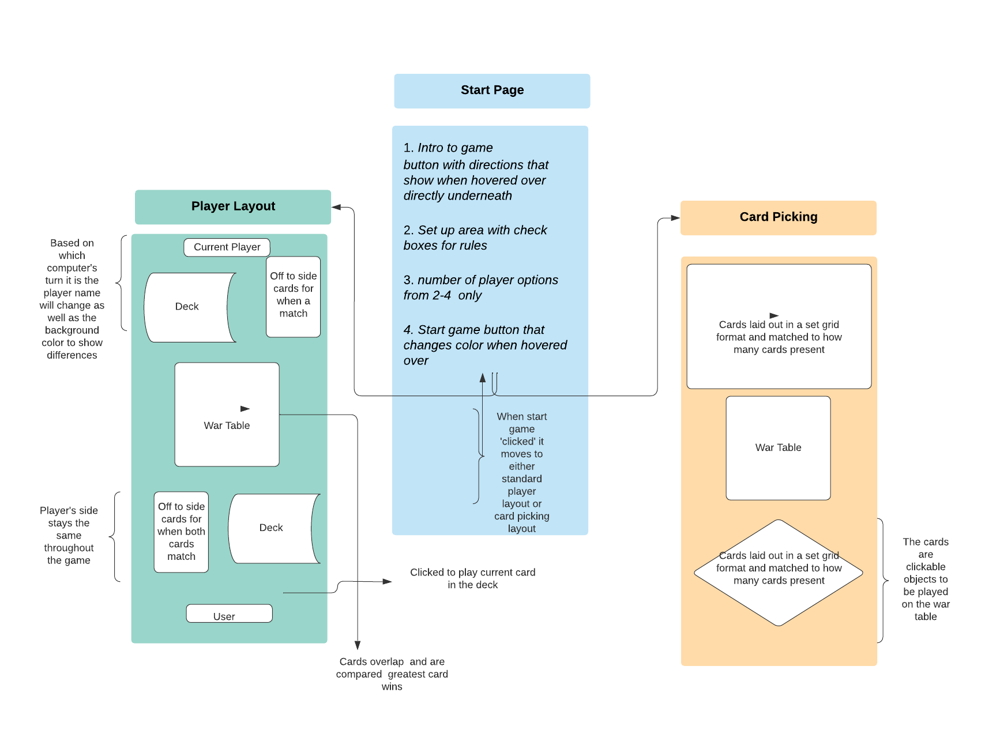

# Project 1 Pitch 'I Declare War'
I declare war is a staple card game that is enjoyed by many. The goal is to take all of your opponents' cards and collect the full deck back. 
## Elevator Pitch
Growing up I played this game with my siblings before school as we waited for our classes to start. It is an excellent game to just waste time and not have to think. It is completely based on luck where you just literally play the cards that you are dealt.

Things get boring when playing the standard game, however there are many rules that can be added to enhance the fun of the game. For instance, having joker cards take all, deuce you lose(where twos beat aces) and Jack of all Trades where Jacks beat Kings. There can be other rules added such as a second deck of high ranks for the times where a win is NEEDED to survive.

This game is fun when playing with friends and has no requirements for anyone to start playing it.

## Tech Stacks
The game will use HTML to hold the game.
JavaScript to create the logic
CSS to create the array of card objects and to render in the browser.

## Wireframes

## MVP Goals
*Render a game board with a minimum of 2 players.
*Render cards that can be played during your turn.
*Allow cards to be shuffled.
*Include instructions on how to play.
*State who wins each round, how many cards left *and who won the full game.
*Have a reset button always availiable.
*The result of a cards with the same value will lead to a 'War'.

## Stretch Goals
*Allow the use of rule changes before the game to set up.
*Have the ability for multiple computer opponents.
*Allow the use of a 3 card deck of high rank cards that is distributed between players with one random small card.
*Allow a line-up style play where instead of choosing from deck cards are lined up face down and player is allowed to choose.
*ability to change deck back
## Potential Roadblocks

*Getting the design to be fluid enough that the changes in game play will  not affect the experience of the user.

*Letting checkboxes to create changes in the code so that the game plays differently

*Creating an ability for multiple computers to work from multiple randomized decks

